# The physics of a laser
The laser is one of the most important tools for ~~current advances in science~~  teasing cats.

In this article, I'll show some properties of the atom and how the atom interacts with light. I'll then use that knowledge to simulate a working laser.

### Light and atom interaction
The whole process of lasing relies on a special mechanic between the atom and the light. So let's examine an atom. For simplicity, let's look at an atom with only one electron. And two states are shown by the two electron orbitals. Of course with a nucleus in the center.

The picture of the atom is completely wrong, but it gets the physics right because the distance here represents energy levels. The picture also gets the physics right because the orbits or the circles represent states for the electron.

As you know electrons can ONLY exist where there is a state. To switch state the electron will do a quantum jump: that is, teleport to another state. But to teleport requires some energy. One way to get that is if the electron absorbs a photon. That's called **Stimulated Absorption**. Once the electron is then in an excited state, it will fall down (deexite) after some random time depending on the half-life of that state. The process is called **Spontaneous Emission**, and it releases a photon in a random direction.

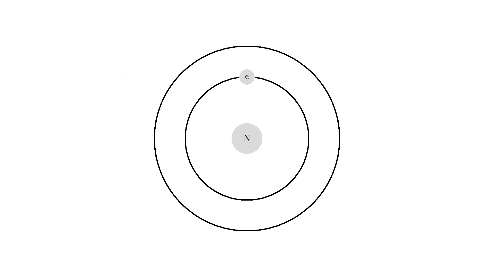

Any photon that interacts with the electron won't necessarily excite it. To excite the electron, the photon have to has the exact same energy as the energy difference between the two states. One example could be excitation energy of 2.00 electron volts. The energy of a photon is perceived as color in our eyes - and 2.00 eV corresponds to red.

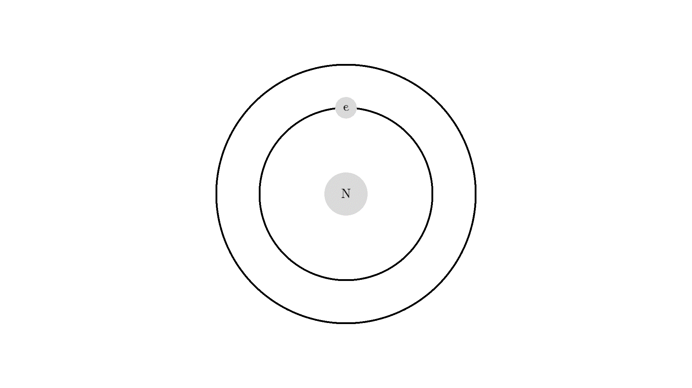

here is an example: a photon of incorrect energy 5.00 eV a UV violet photon, flies into the electron. Nothing happens. A photon with 2.00 eV then flies into the electron and excites the electron. After some random time, the electron deexcites and sends out a 2 eV photon in a random direction.

*Side note - did you have these self glowing stars as a kid? How did it work?* We can use our new knowledge to explain that.

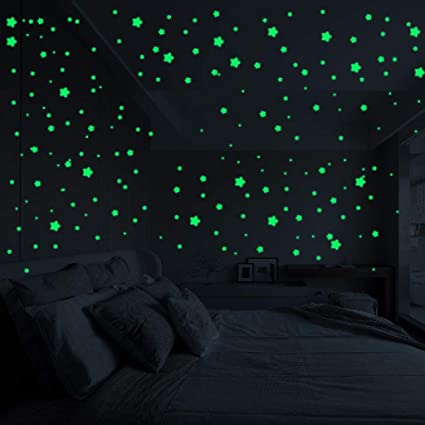

The atoms in the plastic have been shined upon by white light before dark - of course, white light has all visible colors. Some green light then got absorbed by the atom via absorption. The excited state for this specific atom has a very long life-time - we call this a **meta-stable state** - the actual reason why the state has a long life-time has to do with quantum mechanics, specifically the **selection rules**. So after some long time, the electron undergoes spontaneous emission hours later at night! This process is called **phosphorescence**.

It turns out there is one more type of interaction between light and atoms: the **Stimulated emission**. This interaction happens when an excited electron, interacts with a photon of the same excitation energy. In the example below the electron is excited to a 2.00 eV sate. A 2.00 eV photons interact with the electron. The interaction deexcites the electron and sends out another 2.00 eV photon.

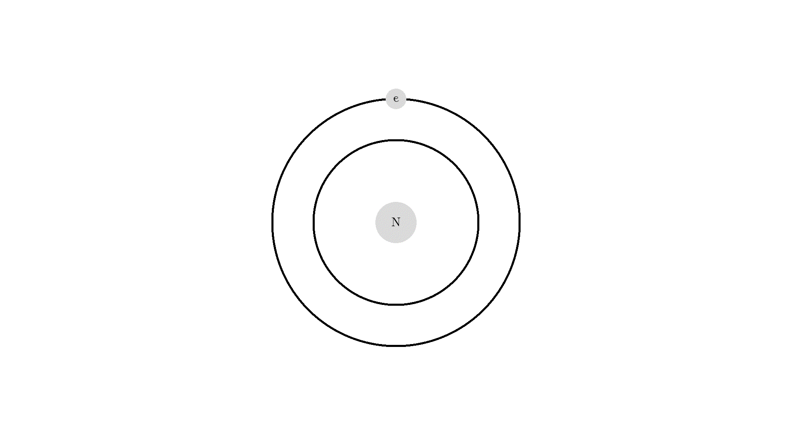

The new photon generated from the interaction has some very important features: It has an identical phase, frequency, polarization, and direction to the photon that interacted with the electron.

Because the frequency is the same, the color or energy is the same for the two photon as well, the two photons are called monochromatic. the identical phase is called coherence.

**L. A. S. E. R** stands for Light amplification by *stimulated emission* of radiation. So lasers work by exploiting that interaction. Let me show you how.

But first, I'll need to show many atoms clumped together so let me simplify and resize the representation of the atom and the photon.  I'll show the photon as a small arrow and the atom as a grey circle. The atom is red when it has an excited electron in the 2.00 eV state.

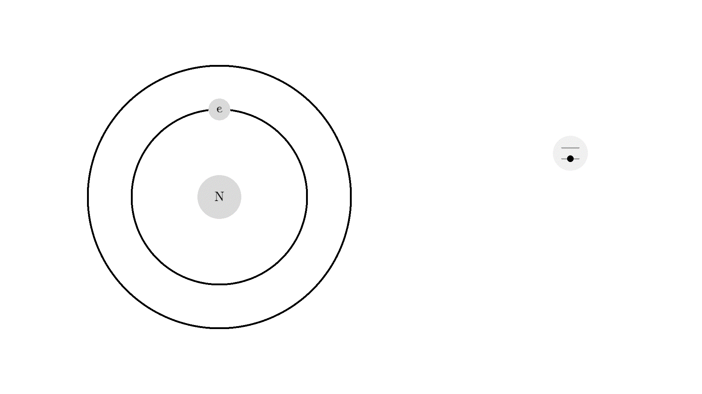

Of course, we can also represent stimulated emission with the new representation

### Optical Cavity

To exploit the stimulated emission processes, let's make an **optical cavity**. It's a cylinder, with mirrors on the sides. When photons hit the mirrors they will change direction, but when they hit the other wall they will fly out of the system - I will just remove them from our drawing. Inside the cavity, there will be what's called a **gain medium**. It's some material that can do this stimulated emission for us. Real-world example could be a synthetic ruby crystal or Helium-Neon gas.

The optical cavity will also have an **optical pump** -  all around the optical cavity but I'll just draw it on the top. The pump is just a very strong flashing light source.

The pump can be tuned to send out the energy in the 2.00 eV red range - the energy needed to excite our atoms.

That looks way too confusing..  So let's make a rule: Instead of drawing photons everywhere, since the radiation pressure from the pump is strong, each time the pump flashes, all atoms have a 50% chance of getting hit by a photon.  I'll put a few atoms in the cavity to show you. The pump flashes once, exciting all the atoms with a 50% chance in the cavity. The atoms will then randomly spontaneously deexcite and send out a 2.00 eV photon.

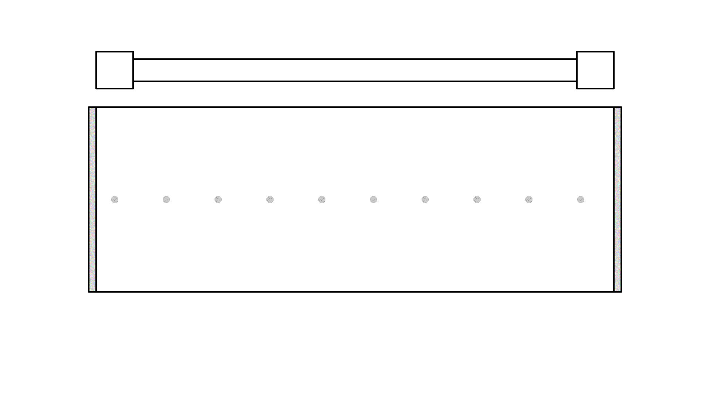

We are almost ready to produce a laser. Obviously there should be many more atoms in the cavity, to work as a gain medium. This is the idea of producing laser light is:

1. We will continuously excite the atoms with the pump.
2. Wait for one of the atoms to send out a photon parallel to the mirrors.
3.  Then the photon will bounce around and create more photons by stimulated emission.

Let me show you the idea, by placing a photon parallel to the mirrors and excite some atoms with the pump:

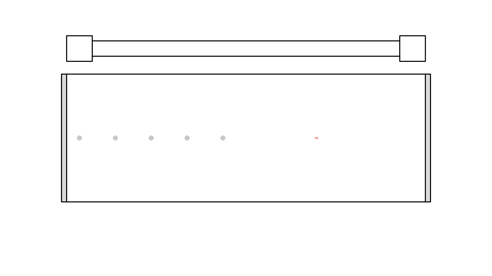

Did you see, at one instance the photon got amplified to 3 photons? But it quickly got absorbed because the atoms weren't excited.

So let's flash with the pump continuously to excite the atoms, it seems like we fixed the problem *but* we intrude a new problem: atoms that are still excited when the pump flashes again, will undergo stimulated emission with light from the pump. The photon from the pump comes from a random direction - so sadly the atoms will release two photons in a random direction - not something we want.

*Instead, we want the atoms to stay excited and wait for a parallel photon to interact with.*
So there is a huge problem with our setup. Can you see what it is? I'll put in more atoms and see what happens when we keep flashing with the pump:

It looks quite confusing, but what I want to show is: no matter what we do, we can't have more than 50% of the atoms in our cavity excited. Because say we are at a point in time where 50% are excited when the pump flashes it will simply invert the atoms: all the atoms that weren't excited will absorb a photon. And all atoms that were excited will be hit with the pump causing stimulated emission and the atom will end up in the unexcited state. Here is the same animation with a plot of the percentage of atoms excited

So we are guaranteed no matter what we do, the atoms in the cavity will always be under 50% excited. *It's a huge problem* because then the photons when interacting with an atom will have over 50% chance of getting absorbed, and under 50% chance of getting amplified by stimulated emission, and so this system eats the photons more than amplifying them. When more than 50% of the atoms are excited we call that **population inversion**, we need that in order to obtain optical gain - So what can we do?

### 3 level atom
Well, the fix is actually simple! We find an atom with 3 energy system available:

This atom has a higher energy state available, and could for example absorb the 5.00 eV UV-photon that the 2 level atom couldn't, given that the energy difference between state 1 and state 3 is 5.00 eV.

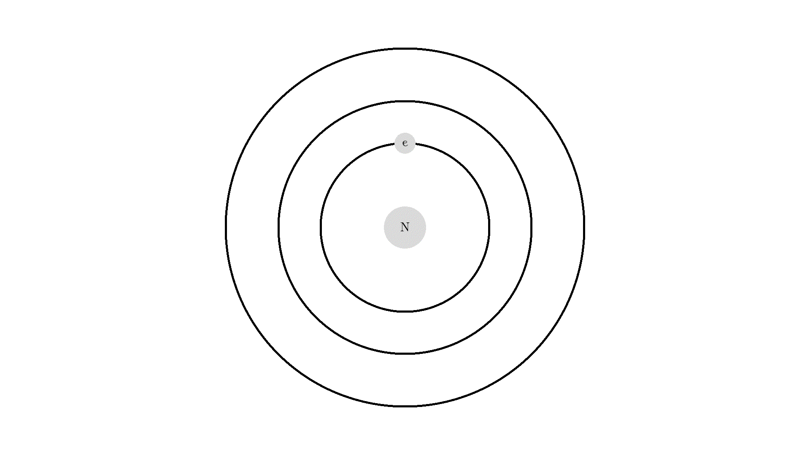

The example showed the atom absorbed a uv light, going from state 1->3. then release a blue photon from state 3->2. and again this red light from state 2->1 as we have seen before. This process is called **photoluminescence**, which you might know from UV parties.

The room is actually lightened up with UV rays, but our eyes can't see that frequency so the room appears dark. But if we have a 3-level atom material that will absorb the UV light at state 3, then spontaneously emit to level 2 and then 1. In our example, The 5.00 eV photon got absorbed, then released a 3.00 eV blue photon and then a 2.00 eV red photon. 3.00 eV and 2.00 eV is visible for our eyes, but 5.00 eV is not!

let me quickly mention one last mechanism of the atom or molecule state: You can also have **radiationless transitions**, where the electron quantum jumps to another state without sending out an atom. Of course, the energy has to go somewhere when it isn't converted to a photon. It could go to kinetic energy, by a collision between the atoms, an auger process where other electrons get the energy, or by vibrational-rotational relaxation.

We won't care about the actual processes, but it's beneficial for the population inversion if we use an atom that can go to from state 3 to 2 in a radiationless transition.

We will also like the atom to have a few other features:
- transition 3 -> 2 should have a very short life-time.
- transition 2 -> 1 should be meta-stable, such that the life-time is much longer!

This is the overall interaction we are interested in in the cavity:

Alright let's use the other representation again for the atom. These are all the 6 different interaction that can happen

Let's put our 3 level atom in the cavity. The flash energy will now be set to 5.00 eV. So each time the flash flashes, all atoms have a 50% of being hit as before. If the atom is hit 3 things can happen depending on the state the atom is in:

- If the atom is in the ground state (state 1), it will be excited to state 3.
- If the atom is in state 2, the 5.00 eV doesn't match any energy levels and so nothing will happen.
- If the atom is in state 3, stimulated emission will occur.

Let's run the system.

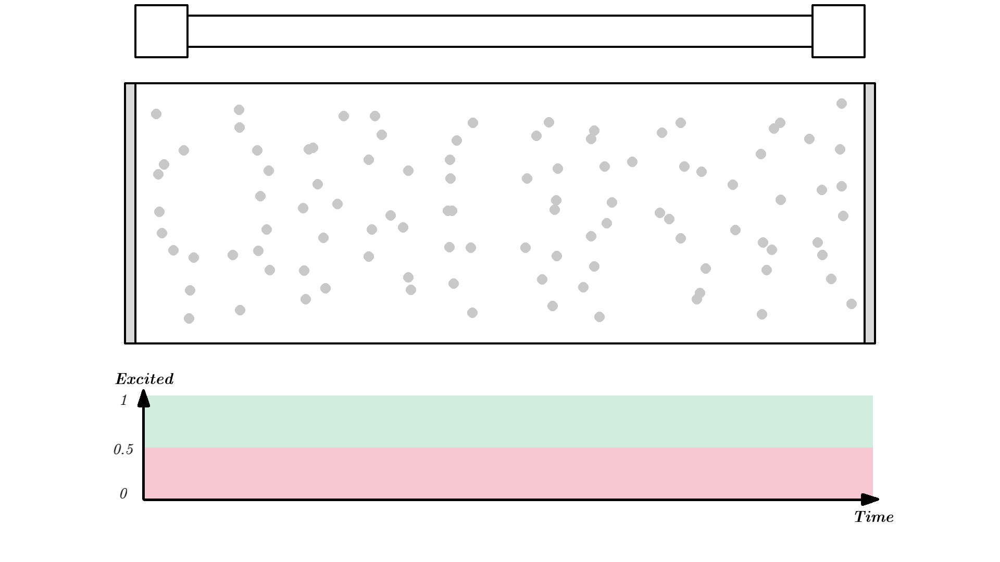

Since state 3 will quickly deexite to a much more stable state 2, over 50% of the atoms can easily be excited. The flash now doesn't de-excited the atoms in state 2 because the energy is 5.00 eV.

Now since over 50% are excited, photons will have a higher chance of getting amplified by stimulated emission, instead of getting eaten by absorption.

To make a working laser, we just need to run the laser for some more time. And to get light out, we let one mirror reflect photons 90% such that 10% of the generated radiation can be emitted out of the laser cavity. The mirror is called the **output coupler**, while the other 100% reflecting mirror is called a **high reflector**.

I won't show different reflecting mirrors, but I will let the simulation run for some time, so you can see how the optical laser builds up a high number of coherent photons. (Click the image below or [this link](https://www.youtube.com/watch?v=FssXv8QR7wU) to see the video, it was too long of a gif).

<a href="http://www.youtube.com/watch?v=FssXv8QR7wU">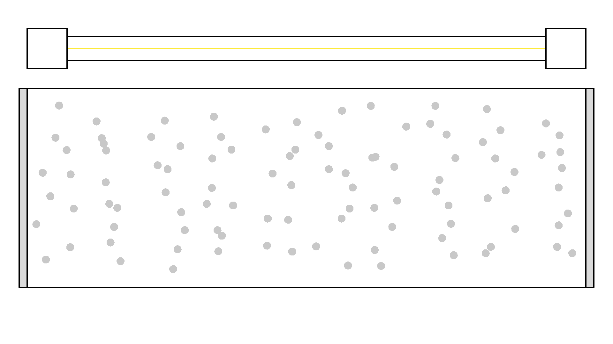</a>

You can see a huge number of photons builds up! And these photons are from stimulated emission, so the direction, phase, and polarization is 100% the same! So this triangle representation of photons isn't that clear how nice the light is we get out. If I use the old wave representation for the photon it shows how nice aligned the light is:

In a real laser, Photons will bounce around the mirror a billion times pr second, and there would be billions of atoms in there as well.

### That's all for lasers or what?

I skipped a few important concepts for the laser. Most importantly: how we get coherent light with optical resonance, by producing a standing wave in the cavity. Another thing I skipped is how nice a 4 level system is.

I also didn't talk about other different kinds of lasers - like how we can pump with kinetic energy instead of light, or what type of lasers we are dealing with solid-state, gas, dye, or semiconductor lasers.

*Cool physics, infinite scientific uses, and the best cat toy make lasers one of the most important discoveries.*

*Happy lasing!*

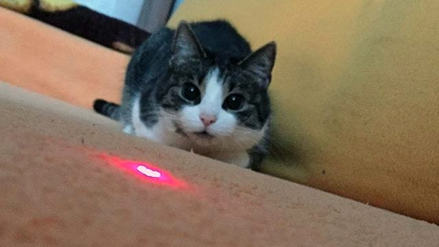

### Thank you
