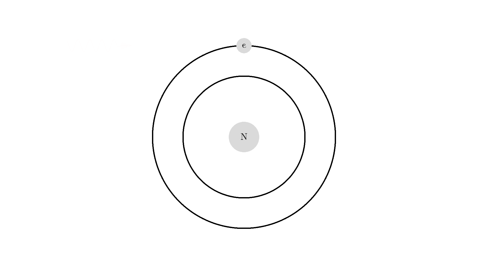
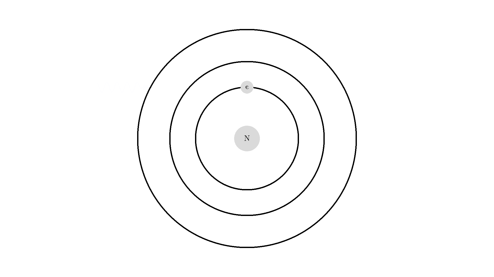

# The surprisingly simple physics of a laser
The laser is one of the most important tools for ~~advances in science~~  teasing cats.

In this article, I'll show some properties of the atom and how the atom interacts with light. I'll then use this knowledge to simulate a working laser.

Help me produce more free physics content, like this article: [become my Patreon](https://www.patreon.com/Higgsino) or by support by [watching other interesting physics content from me](https://www.youtube.com/c/Higgsinophysics/featured?view_as=subscriber).

### Light and atom interaction
The whole process of lasering relies on a special interaction between the atom and the light. So let's examine an atom. For simplicity, let's look at an atom with only one electron. Two states are shown by the two electron orbitals with a nucleus in the center.

The picture of the atom is completely wrong, but it gets the physics right because the distance between the two states represents energy levels for the electron.

As you know electrons can *ONLY* exist in a state and not in between two states. To switch state the electron will do a **quantum jump**: A transition to another state. But a transition requires some energy. One way to get the energy is for the electron to absorb a photon. This is called **Stimulated Absorption**. Once the electron is in an excited state, it will return to a lower energy state (relax) after some random time depending on the lifetime of the excited state. This process is called **Spontaneous Emission**, and releases a photon in a random direction.

Any photon that interacts with the electron won't necessarily excite it. To excite the electron, the photon needs to have the exact same energy as the energy difference between the two states. One example could be an excitation energy of 2.00 electron volts (eV). To the human eye, the energy of a photon is perceived as color - and 2.00 eV corresponds to red.

Here is an example: When a photon of incorrect energy of 5.00 eV, which corresponds to a ultraviolet photon, passes the electron, the energy is too high and it can't excite the electron. But when a photon with 2.00 eV passes the electron, the electron is excited. After some time, the electron relaxes and sends out a 2.00 eV photon in a random direction.

*Side note - did you have these self glowing stars as a kid? How did it work?* We can use our new knowledge to explain this.

The atoms in the plastic have been illuminated by white light during the day. White light consists of all visible colors. Green light got absorbed by the atoms in the plastic. The excited state for the specific atoms in the plastic have a very long lifetime - we call this a **meta-stable state**. The reason why the state has a long lifetime has to do with quantum mechanics, specifically the **selection rules**. So after some long time, the electron undergoes spontaneous emission hours later at night! This process is called **phosphorescence**.

Now back to our atom. It turns out there is one more type of interaction between light and atoms: the **Stimulated emission**. This interaction happens when an excited electron interacts with a photon of the same energy used to excite the electron. In the example below the electron is excited to a 2.00 eV state. A 2.00 eV photon is then able to interact with the electron. The interaction relaxes the electron and emits a 2.00 eV photon.

The new photon generated from the interaction has some very important features: It has an identical phase, frequency, polarization, and direction to the photon that interacted with the electron.

Because the frequency is the same, the color or energy is identical and therefore the two photons are called **monochromatic**. The identical phase is called **coherence**.

So now that we understand the concepts of atom-light interactions, we are almost ready to build a laser.
*L. A. S. E. R*. is an abbreviation of "Light Amplification by *Stimulated Emission* of Radiation". So lasers work by exploiting that interaction. Let me show you how.

But first, I'll need to show many atoms clumped together so let's simplify and resize the representation of the atom and the photon.  I'll show the photon as a small arrow and the atom as a gray circle. The atom is red when it has an excited electron in the 2.00 eV state.

Of course, we can also represent stimulated emission with the new representation

### Optical Cavity

To exploit the stimulated emission processes, let's make an **optical cavity**. It's a cylinder, with mirrors in the ends. When photons hit the mirrors they will change direction, but when they hit the outer wall they will fly out of the system - I will just remove them from our simulation. Inside the cavity, there will be what's called a **gain medium**. It's a material that can perform stimulated emission for us. A real-world example could be a synthetic ruby crystal or Helium-Neon gas.

The cavity will also contain an **optical pump**. In fact, there are multiple pumps all around the circumference of the cavity but I'll just draw it on the top. The pump is just a very strong flashing light source.

The pump can be tuned to send out photons in the 2.00 eV red range - the energy needed to excite our atoms.

That looks way too confusing..  So let's make a rule: Instead of drawing photons everywhere, since the radiation pressure from the pump is strong, each time the pump flashes, all atoms have a 50% chance of getting hit by a photon.  I'll put a few atoms in the cavity and flash once with the pump to show you. Approximately half of the atoms will get excited, and later spontaneously emit a photon.

We are almost ready to produce a laser. Obviously there should be many more atoms in the cavity, for it to work as a gain medium.

This is the idea of producing laser light:

1. We will continuously excite the atoms with the pump.
2. We then wait for one of the atoms to send out a photon orthogonal to the mirrors.
3.  Then the photon will bounce around and create more photons by stimulated emission.

Let me show you the idea, by placing a photon orthogonal to the mirrors and excite some atoms with the pump:

Did you see, at one instance the photon got amplified to 3 photons? But it quickly got absorbed because the atoms weren't excited.

So let's flash with the pump continuously to excite the atoms. Now it seems we fixed the problem *but* we introduce a new problem: atoms that are still excited when the pump flashes again, will undergo stimulated emission with light from the pump. The photon from the pump comes from a random direction - so sadly the atoms will release two photons in a random direction - not something we want.

*Instead, we want the atoms to stay excited and wait for a orthogonal photon to interact with.*
So there is a huge problem with our setup. I'll put in more atoms and let's see what happens when we keep flashing the pump:

It looks quite confusing, but what I want to show is: no matter what we do, it's physically impossible to have more than 50% of the atoms in the cavity excited at once. Why? Say we are at a point in time where 50% are excited. When the pump flashes it will simply invert the atoms: all the atoms that weren't excited will absorb a photon and all atoms that were excited will be hit with the pump causing stimulated emission and the atom will end up in the unexcited state. Here is the same animation with a plot of the percentage of atoms excited.

So no matter what we do, we are guaranteed that at any given time less than 50 % of the atoms in the cavity will by excited. *It's a huge problem* because we can't multiply photons in this system.  The reason is the photons will have a higher chance of getting absorbed than getting duplicated by stimulated emission. On average this system eats the photons more than amplifying them.

To obtain optical gain we need more than 50% of the atoms to be excited. We call this **population inversion**, specifically when 50% or more of the atoms have electrons excited in the state we use for lasering - that's state 1 in our example.

We need to change something for our laser to work.

### 3 level atom
Well, the fix is actually simple! We find an atom with a 3 energy system:

This atom has a higher energy state available, and could for example absorb the 5.00 eV UV-photon that the 2 level atom couldn't as the energy difference between state 1 and state 3 is 5.00 eV.

The example shows the atom absorbing an ultraviolet light, going from state 1->3, then the atom release a blue photon from state 3->2 and later releases a red photon going from state 2->1. This process is called **photoluminescence**, which you might know from UV parties.

*Another, but short side-note.* In this UV picture, the room is actually lit up with UV rays, but our eyes can't see that frequency so the room appears dark. But if we have a 3-level atom material that will absorb the UV light at state 3, then it will spontaneously emit to level 2 and then 1. In our example, The 5.00 eV photon got absorbed, then released a 3.00 eV blue photon and then a 2.00 eV red photon. 3.00 eV and 2.00 eV is visible to our eyes, but 5.00 eV is not! The picture shows green and red/orange light from the body paint, being emitted in this process.

Let me quickly mention one last mechanism of the atom or molecule state: You can also have **radiationless transitions**, where the electron quantum jumps to another state without sending out a photon. Of course, the energy has to go somewhere when it isn't converted to a photon. For example, it could go to kinetic energy by a collision between two atoms, to an Auger process where other electrons get the energy, or to vibrational-rotational relaxation.

We won't care about the actual processes, but it's beneficial for the population inversion if we use an atom that can go to from state 3 to 2 in a radiationless transition.

We will also like the atom to have a few other features:
- transition 3 -> 2 should have a very short lifetime.
- transition 2 -> 1 should be meta-stable, such that the lifetime is much longer!

### Working laser

This is the desired interaction in the cavity:

Alright let's use the other representation again for the atom. These are all the 6 possible interactions:

Let's put our new 3 level atom in the cavity. The pump/flash energy will now be configured to send out 5.00 eV photons. So as before each time the pump flashes, all atoms have a chance 50% of being hit. If the atom is hit 3 things can happen depending on the initial state of the atom:

- If the atom is in the ground state (state 1), it will be excited to state 3.
- If the atom is in state 2, the 5.00 eV doesn't match any energy levels and so nothing will happen.
- If the atom is in state 3, stimulated emission will occur.

Let's run the system.

Since state 3 will quickly deexite to a much more stable state 2, over 50% of the atoms can easily be excited. Now the flash will not relax atoms in state 2 because the energy is 5.00 eV, and not 2.00 eV anymore.

When over 50% of the atoms are excited, photons will have a higher chance of getting amplified by stimulated emission, instead of getting eaten by absorption.

To make a working laser, we just need to run the laser for some more time. And to get light out, we let one mirror reflect photons 90% such that 10% of the generated radiation can be emitted out of the laser cavity. The mirror is called the **output coupler**, while the other 100% reflecting mirror is called a **high reflector**.

I won't show different reflecting mirrors, but I will let the simulation run for some time, so you can see how the optical cavity builds up a high number of coherent photons. (Click the image below or [this link](https://www.youtube.com/watch?v=FssXv8QR7wU) to see the video, it was too long of a gif).

You can see a huge number of photons builds up! And these photons are from stimulated emission, so the direction, phase, and polarization is identical! This triangle representation of photons does not clearly show how nice the resulting light is. If I use the old wave representation for the photon it shows how nicely aligned/coherent the light is:

In a real laser, photons will bounce around the mirror a billion times per second, and there would be billions of atoms in there as well.

### That's all for lasers or what?

There are many other interesting facts about lasers, but I'll save that for part 2.  Specifically, I didn't talk about how we get coherent light with optical resonance. I also didn't talk about the advantage of using a 4 level atom for the gain medium. Lastly, I didn't mention other different kinds of lasers. For example how we can pump with kinetic energy instead of light, or what type of lasers we are dealing with solid-state, gas, dye, or semiconductor lasers.

*Cool physics, infinite scientific uses, and the best cat toy make lasers one of the most important discoveries.*

*Happy lasering!*

### Thank you

- I would like to thank [Pretty Much Physics](https://www.youtube.com/channel/UCVa8De6q6aOjtx_TEiDBaMw), [Zap Physics](https://www.youtube.com/channel/UCGTW2EYuaDEthocEP30xQtg), [Zap Physics](https://www.youtube.com/channel/UCCxOJkK9P136zmiKN03FFZg) and [Ancient Accounts](https://www.youtube.com/channel/UCtvilhINC4WP6q9pvqt5Ulw) for helping me correcting this article. They all run brilliant and interesting science YouTube channels.
- I would also like to thank generous Patrons for supporting this article. Help me produce more free physics content for the world on [patreon.com/higgsino](https://www.patreon.com/Higgsino).
- Thank you to the kind folks over at [p5py](https://github.com/p5py/p5) for specifically creating a save-frame function so I could use their python package to make all these animations.
