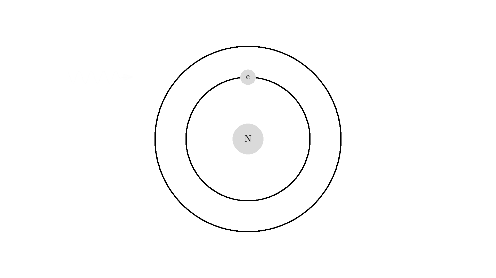
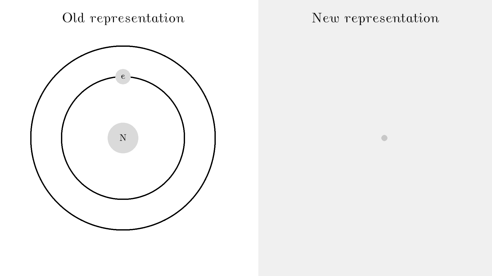
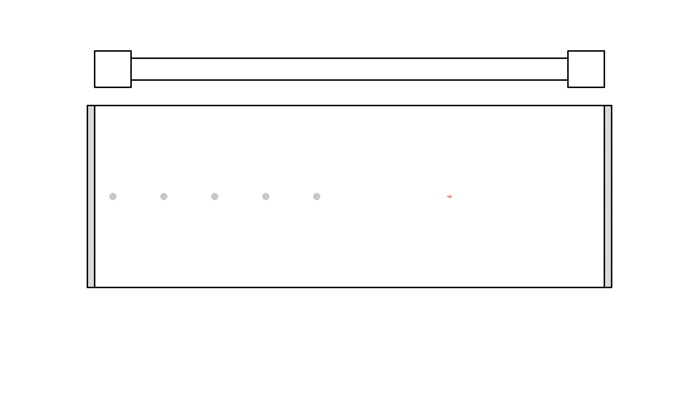

# The physics of a laser
The laser is one of the most important tools advances in science. I mean, it's one of the most important tools to tease cats.

In this video, I'll show you the physics of lasers, and simulate a working laser as well.

Consider helping me create more free physics material, by supporting with whatever you want on Patreon.

### Light and atom interaction
The whole processes of lasing relies on a special mechanic between the atom and the light. So let's examine an atom. For simplicity lets look at an atom with only one electron. And two states shown by the two electron orbitals. The atom as a nucleus as well.

Off course the picture of this atom is completely wrong, but it gets the physics right, because the distance here represent energy levels. The picture also get the physics right because the orbits or the circles represents states for the electron. The electron can ONLY exists where there is a state. To switch state the electron will do a quantum jump: that is, teleport to another state. But to teleport requires some energy. One way to get that is if the electron absorbs a photon. That's called **Stimulated Absorption**. Once the electron is then in a excited state, it will fall down after some random time depending on the half life of that state. The processes is called **Spontaneous Emission**, and it releases a photon in a random direction in this processes.

Any photon that interacts with the electron wont excite it. To excite the electron, to photon have to have the exact same energy as the energy difference between the two states. One example could be a excitation energy of 2.00 electron volts. The energy of a photon is perceived as color in our eyes - and 2.00 eV corresponds to red.

here is an example: a photon of incorrect energy 4,00 eV a violet color, flies into the electron. Nothing happens. A photon with 2 eV then flies into the electron and excites the electron. After some random time, the electron deexcites and sends out a 2 eV photon in a random direction.

Did you have have these self glowing stars as a kid? How did it work?

The atoms in the plastic have been shined upon by white light before dark - off course white light have all visible colors. Some green light then got absorbed by the atom via stimulated emission. The excited state for this specific atom have a very long life-time, and the electron undergoes spontaneous emission hours later at night! This processes is called fluorescence.

It turns out there is one more type of interaction between light and atoms: the **Stimulated emission**. This interaction happens when an excited electron, interacts with a photon of the same excitation energy. In the example below the electron is excited to a 2.00 eV sate. A 2.00 eV photons interacts with the electron. The interaction deexcites the electron and sends out another 2.00 eV photon.

The new photon generated from the interaction have some very important features: It has an identical phase, frequency, polarization, and direction to the photon that interacted with the electron.

Because the frequency is the same, the color or energy is the same for the two photon as well, the two photons are called monochromatic. the identical phase is called coherence.

**L. A. S. E. R** stands for Light amplification by *stimulated emission* of radiation. So lasers works by exploiting that interaction. Let me show you how.

But first, I'll need to show many atoms later so let me simplify and resize the representation of the atom and the photon.  I'll show the photon as a small arrow and the atom is a grey circle. The atom is red when it has an excited electron in the 2.00 eV state.

Off course we can also represent stimulated emission with the new representation

### Optical Cavity

the exploit the stimulated emission processes, let's make an optical cavity. It's a cylinder, with mirrors on the sides. When photons hit the mirrors they will change direction, but when they hit the other wall they will fly out of the system - I will just remove them from our drawing. Inside the cavity there will be what's called a "gain medium". It's some material that can do this stimulated emission for us - real world example could be a synthetic ruby crystal or Helium Neon gas.

The optical cavity will also have a optical pump - actually all around the optical cavity but I'll just draw it on the top. The pump is just a very strong flashing light source.

 The pump can be tuned to send out the energy in the 2.00 eV red range - the energy needed to excite our atoms.

That looks way too confusing..  So let's make a rule: Instead of drawing photons everywhere, since the radiation pressure from the pump is strong, let's say all the atoms are being hit with a photon from a random direction. I'll put a few atoms in the cavity as a gain medium. The pump flashes once, exciting all the atoms in the cavity. The atoms will then randomly spontaneously deexcite and send out a 2.00 eV photon.

We are almost ready to produce a laser. This is the idea of producing laser light is:

0. Obviously there should be many more atoms in the cavity.
1. We will continuously excite the atoms with the pump.
2. Wait for one of the atoms to send out a photon parallel to the mirrors.
3.  Then the photon will bounce around and create more photons by stimulated emission.

I'll put a few atoms in the cavity again and let me just place a photon parallel and flash the pump once. To see the amplification of photons.

Did you see, at one instance the photon got amplified to 3 photons? But it quickly got absorbed because the atoms wasn't excited.

So let's flash with the pump continuously to excite the atoms - **but** atoms that are still excited when the pump flashes again, will undergo stimulated emission. The photon form the pump comes from a random direction - so sadly the atoms will release two photons in a random direction - not something we want. Instead we want the atoms to stay excited and wait for a parallel photon to interact with. 

